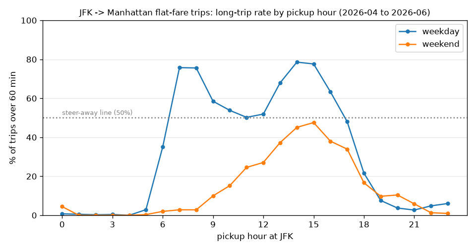

# When is the JFK queue worth it? JFK -> Manhattan yellow taxi trip times


## 1. Project scope

This Track B project takes a client problem from messy source data to a pipeline with traceable metrics. It
includes a workflow view of NYC taxi trips, duration and location validation, five operational metrics, and a
repeatable monthly run. The repository contains a README, source map, workflow/data model diagram, notebooks,
a runnable pipeline, and an evidence table covering knowns, unknowns, assumptions, and limitations.

## 2. The problem

JFK to Manhattan is a flat fare in a yellow cab: $70 plus applicable surcharges, tolls and tip, however long it takes. A driver who
picks up at the wrong hour can spend well over an hour in traffic for the same $70 they'd get in 35 minutes at
night. The fleet's operations manager wants to know which pickup hours are worth sending drivers into the JFK
queue for.

Raw-file sizing before any rules (end of notebook 01) found 212,688 JFK -> Manhattan trips in
three months and 34.4% took over an hour. The hour matters a lot: a weekday 14:00 pickup has a median of 70.2
minutes ($58.99 per hour on the meter), a weekday 21:00 pickup 39.0 minutes ($104.21 per hour).

Stakeholder roles used for the analysis:

| Role | What they need |
|---|---|
| Fleet operations manager (decision owner) | a by-hour guide for when to send cabs to JFK, and a number to track monthly |
| Dispatcher | a short go / don't go list by hour and day type |
| Lease drivers | not to lose an afternoon on one $70 fare; they think in dollars per hour |
| Fleet owner / finance | revenue per cab-hour |
| NYC TLC (data publisher) | owns the data; the Helix timestamp problem below should go to them |

**Project KPI:** long-trip rate, the share of valid JFK -> Manhattan flat-fare trips that take more than 60
minutes. At $70 a trip, 60 minutes is $70 per hour on the meter. Lower is better.

**Decision it supports:** which JFK pickup hours to steer drivers toward (long-trip rate 10% or lower) or away
from (50% or higher). The advice per hour is in the evidence table.

## 3. Sources and retrieval

Full source map (question -> information -> source -> owner -> grain -> gaps): [docs/source_map.md](docs/source_map.md).

| Source | Owner | Grain | Retrieval | Used for |
|---|---|---|---|---|
| TLC yellow trip records (parquet) | NYC TLC, records made by the TPEP vendors | one row per trip | file over HTTPS | times, zones, final rate code, fare |
| TLC taxi zone lookup (CSV) | NYC TLC | one row per zone (265) | file over HTTPS | which zones are JFK / Manhattan |
| Open-Meteo historical weather | Open-Meteo | one hour, one point near JFK | JSON API | wet vs dry hours |

Gaps: there is no JFK queue data, so the analysis covers trip time rather than queue wait. There is also no medallion id, so all yellow
cabs stand in for the client's fleet).

Two retrieval modes: files over HTTPS and a JSON API. DuckDB SQL is then used to query them. Code:
`pipeline/ingest.py`, walkthrough: notebook 01. Completeness checks:

- Parquet size on disk = HTTP Content-Length for all three months.
- Rows read = parquet footer rows (3,831,240 / 4,090,836 / 3,837,248), every day has pickups, and the row count
  is within 15% of the previous month.
- Weather: 720 / 744 / 720 hourly rows = days x 24, no nulls.
- sha256, size, Last-Modified and download time go into [data/raw_manifest.json](data/raw_manifest.json).
  Raw files stay untouched in `data/raw/` (gitignored, about 200 MB).

## 4. Validation

Profiling: notebook 02. Rules: `pipeline/validate.py`. Full table with reason, severity, action and counts:
[docs/validation_rules.md](docs/validation_rules.md). Every trip is kept in `trips_validated` with one
true/false column per rule, so nothing is silently dropped.

The issues that mattered:

- VendorID 7 (Helix) sends dropoff time = pickup time on 100% of its trips: 2,148 JFK -> Manhattan trips with
  no usable duration. Excluded (V02) and warned about every run, not imputed.
- RatecodeID records the final rate code in effect, but it is not a reliable route definition by itself: 27% of
  rate code 2 records aren't JFK -> Manhattan zone pairs (see section 8).
- 21-26% of all rows have no RatecodeID and no passenger_count; they are all payment_type 0 (Flex Fare).
- 1,435 trips with a zero or negative fare (V05) and 123 with the meter on over 3 hours (V04, max 41 hours).
- June has a `request_source` column that April, May and the data dictionary don't have.

Result: of 212,688 zone-pair trips, 3,743 (1.8%) excluded for quality, 9,789 out of scope (not rate code 2),
199,156 used. The counts reconcile every run.

## 5. Workflow model and metrics

Workflow: decide to go to JFK at hour H (the intervention) -> queue (not in the data) -> meter on at JFK ->
drive -> meter off in Manhattan -> payment. The measurable outcome is the meter-on to meter-off segment.

Model in `data/processed/jfk_trips.duckdb` (`pipeline/model.py`): `trip_fact` (one row per valid trip) with keys
to `dim_hour` (hour, day type, weather), `dim_zone` and `dim_vendor`, plus the views `trip_events` (meter_on /
meter_off) and `trip_analysis`. Joins and aggregations are DuckDB SQL by month and by day type x pickup hour.
Diagrams: [docs/workflow_diagram.md](docs/workflow_diagram.md).

Metrics ([definitions and KPI link](docs/metric_definitions.md)):

1. Long-trip rate (KPI)
2. Median and P90 duration
3. Effective fare per trip-hour (actual fare / hours on the meter)
4. Quality exclusion rate (data reliability by month)
5. Wet vs dry long-trip rate, raw and within the same hour

## 6. Pipeline dependability

`python -m pipeline.run --months 2026-04 2026-05 2026-06` runs ingest -> validate -> model -> metrics.

- Logging: console + `logs/pipeline.log`. Run logs are in [docs/run_logs/](docs/run_logs/).
- Checks between stages: schema, footer vs loaded rows, month coverage, volume, vendor timestamps, weather
  hours, count reconciliation, then a gate (quality exclusions <= 10%, at least 1,000 valid trips) and an
  orphan-key check on the model.
- Rerun: a raw file is downloaded only if it's missing, its size / sha256 don't match the manifest, or TLC's
  Last-Modified changed (TLC does replace months). Offline reruns use the local copy. Tables are
  delete-then-insert per month, so a rerun gives byte-identical outputs.
- Failures: downloads retry 3 times with backoff through a `.part` file. An unpublished month (HTTP 403) or a
  failed gate stops the run with exit 1 and leaves `outputs/` unchanged. If the weather API is down, metric 5
  says n/a and the rest publishes. New output files are fully built in `outputs/.tmp/` before final replacement,
  so validation and generation failures cannot publish incomplete files.

| Log | What happened | Exit |
|---|---|---|
| `run1_fresh_download.log` | downloaded everything, built outputs | 0 |
| `run2_rerun_skips.log` | all downloads skipped, same outputs | 0 |
| `run3_missing_month.log` | asked for 2026-10, HTTP 403, outputs unchanged | 1 |
| `run4_gate_fail_strict_threshold.log` | limit set to 1% on purpose, gate G01 failed | 1 |
| `run5_weather_api_down.log` | weather host blocked, wet/dry = n/a, rest published | 0 |

`pytest` runs 11 tests in `tests/test_validation.py` (rules, gate, download skip, re-published month, missing
month, weather down, and a full run on a tiny fake month).

## 7. Setup and run

Python 3.12, about 250 MB of disk.

```bash
python3 -m venv .venv
source .venv/bin/activate
pip install -r requirements.txt

python -m pipeline.run --months 2026-04 2026-05 2026-06    # first run downloads about 200 MB
pytest

cd notebooks    # the notebooks read what the pipeline saved, so run it first
jupyter nbconvert --to notebook --execute --inplace 01_sources_and_retrieval.ipynb
jupyter nbconvert --to notebook --execute --inplace 02_profiling_and_validation.ipynb
jupyter nbconvert --to notebook --execute --inplace 03_model_and_metrics.ipynb
```

`--force-download` fetches fresh copies. A new month is just another `--months` value.

```
pipeline/    config.py (thresholds), ingest.py, validate.py, model.py, metrics.py, run.py
notebooks/   01_sources_and_retrieval, 02_profiling_and_validation, 03_model_and_metrics
docs/        source_map, workflow_diagram, validation_rules, metric_definitions, run_logs/
data/        raw_manifest.json (committed); raw/ and processed/ are gitignored
outputs/     evidence_table.md, metrics CSVs, validation_report.csv, pipeline_checks.csv, 2 charts
tests/       test_validation.py
```

## 8. Final results

From [outputs/evidence_table.md](outputs/evidence_table.md) (the by-hour table with advice is there too).
Valid JFK -> Manhattan flat-fare trips, Apr-Jun 2026:

| # | Metric | Apr 2026 | May 2026 | Jun 2026 | All months |
|---|---|---|---|---|---|
| 1 | Long-trip rate, share of trips over 60 min (KPI) | 28.0% | 39.9% | 35.5% | 34.5% |
| 2 | Median / P90 trip duration (min) | 50.2 / 72.8 | 54.7 / 80.9 | 53.5 / 76.9 | 52.7 / 77.2 |
| 3 | Effective fare per trip-hour | $80.76 | $74.07 | $76.49 | $76.98 |
| 4 | Quality exclusion rate | 1.6% | 1.8% | 1.8% | 1.8% |
| 5 | Long-trip rate, wet vs dry hours (raw) | 27.4% vs 28.0% | 35.6% vs 40.2% | 49.8% vs 34.2% | 38.3% vs 34.2% |
| 5b | Wet minus dry, within the same day type and hour | +4.4 pts | -9.3 pts | +12.6 pts | +3.6 pts |
| | Valid trips used | 65,594 | 67,271 | 66,291 | 199,156 |



- Weekday daytime is bad: every weekday hour from 07:00 to 16:00 has half or more trips over an hour, and
  14:00-15:00 is worst (78.6% and 77.6%, about $59 per hour).
- Weekday evenings and nights are good: 19:00 to 05:00 no hour is above 10%, $92-$131 per hour.
- Weekends are flatter; the afternoon is slowest but stays under 50%.
- Same shape every month but a different level (28.0% / 39.9% / 35.5%), so it needs the monthly refresh.
- Rain: +3.6 points overall, but May is -9.3 and June +12.6, so it isn't consistent enough to use.

Suggested guidance: on weekdays, steer drivers away from JFK pickups between 07:00 and 16:00 and toward JFK
from 19:00 on. On weekends JFK is fine most of the day. This covers trip time only; queue wait could change it.

**Judgement call: what counts as a "JFK -> Manhattan run".** `RatecodeID = 2` is the JFK flat-fare code, but it
only records the final rate code in effect and does not reliably identify the route. About 27% of rate code 2
records are not JFK -> Manhattan zone pairs, mostly because they travel in the opposite direction. The route is
therefore defined by meter-on and meter-off locations (zone 132 to a Manhattan zone), with the rate code used as
the flat-fare scope filter. Notebook 03 compares the definitions: rate code alone adds about 61,500
wrong-direction or unrelated trips and changes the advice in five hour cells.

## 9. Known / Unknown / Assumption / Limitation

**Known:**
- 212,688 JFK -> Manhattan trips in Apr-Jun 2026; 34.5% of the 199,156 valid ones took over 60 minutes.
- Weekday 07:00-16:00 is at or above 50% every hour; weekday 19:00-05:00 is at or below 10%.
- VendorID 7 has no usable dropoff times in any month.

**Unknown:**
- How long drivers wait in the JFK queue at each hour.
- Which trips were the client's cabs, and what drivers keep after the lease.
- What `request_source` in the June file means, and why May and June were slower than April.
- Whether rain has a real effect; the months disagree.

**Assumptions:**
- A run = pickup zone 132 to a Manhattan zone; rate code 2 decides if it's flat fare.
- All yellow cabs are a fair stand-in for the client's fleet.
- Thresholds (60 min, 10 / 180 min bounds, 0.5 mm wet hour, 10% / 50% advice) are in `pipeline/config.py`.

**Limitations:**
- Three spring/early summer months only.
- Trip time only, so $/trip-hour overstates a driver's hourly earnings (no queue, no drive back).
- Weather is one grid point near JFK, and only 6-8% of hours are wet.
- Excluding Helix trips (about 1%) could bias things a little if Helix cabs work different hours.
