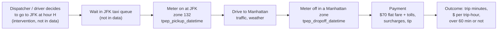
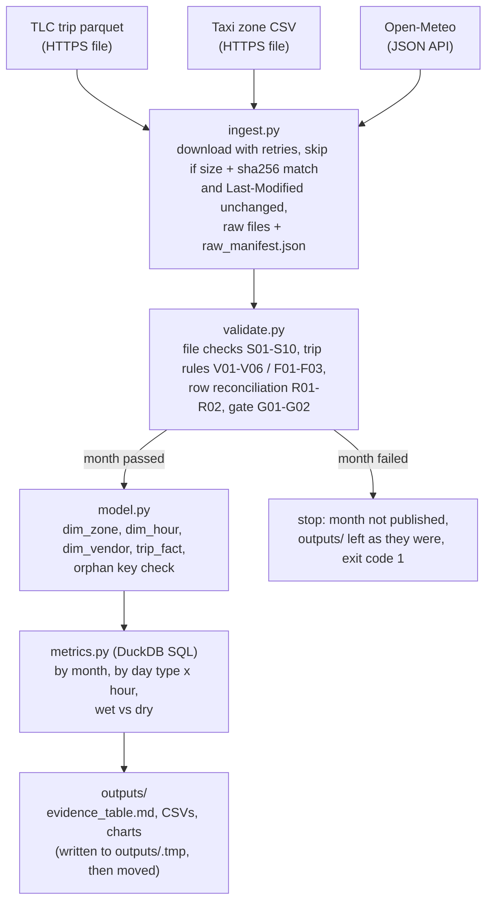
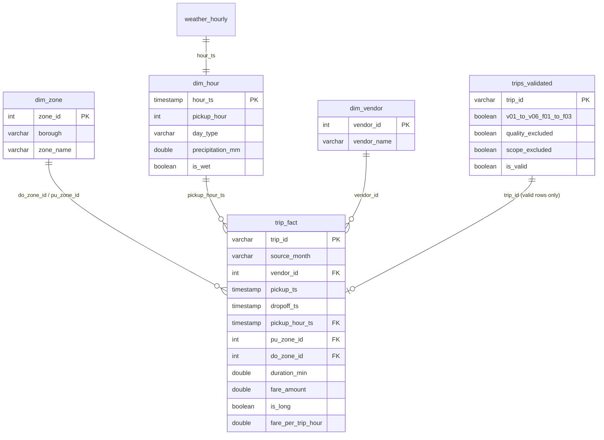

# Workflow and data model

## 1. The business workflow (what happens to one JFK run)



Plain-text version:

```
[decide to go to JFK at hour H] -> [queue wait] -> [meter on @ JFK] -> [drive] -> [meter off @ Manhattan] -> [payment]
      intervention (not in data)     (not in data)    pickup event                   dropoff event          fare_amount, tip
                                                        |________________ measurable outcome _________________|
                                                           duration_min, is_long (> 60 min), fare_per_trip_hour
```

States a trip can end up in after validation: `valid` (used for metrics), `quality_excluded` (broke one of
V01-V05), `out of scope` (zone pair is right but rate code is not 2). Flags F01-F03 don't change the state.

## 2. Pipeline flow



## 3. Relational model (in `data/processed/jfk_trips.duckdb`)



Two views sit on top: `trip_events` shows each trip as two events (meter_on at `pu_zone_id`, meter_off at
`do_zone_id`), and `trip_analysis` joins `trip_fact` to `dim_hour`, `dim_zone` and `dim_vendor`. The metrics
are computed from `trip_analysis`. After building a month the pipeline checks that every `trip_fact` row finds
its hour and both of its zones.
